# 💻 Dell Laptop Vergleich

*📅 Generiert am: 29.11.2025 08:15:44*

## 📊 Zusammenfassung

- 💻 **Laptops analysiert:** 11
- 💰 **Durchschnittspreis:** €889.08
- 🏆 **Günstigster:** €679.00 (Dell Precision 5550)
- 💎 **Teuerster:** €980.00 (Dell Precision 3561)
- 📸 **Bilder extrahiert:** 896

### Preis-Bewertung Verteilung

- **Sehr gut (>60% Rabatt):** 5 Laptop(s)
- **Gut (50-60% Rabatt):** 3 Laptop(s)
- **Akzeptabel (30-40% Rabatt):** 1 Laptop(s)
- **Fair (40-50% Rabatt):** 1 Laptop(s)
- **Zu teuer (<30% Rabatt):** 1 Laptop(s)

## 📋 Detaillierte Laptop-Liste

---

### Dell Precision 5550

**Preis:** €679.00 🔴 *Zu teuer (<30% Rabatt)*

**Originalpreis:** €699.00 | **Rabatt:** 2.9%

#### Technische Daten

| Spezifikation | Details |
|--------------|----------|
| **Prozessor** | Intel Core i9-10885H |
| **Kerne** | nan |
| **Taktfrequenz** | 2.4 GHz |
| **RAM** | 32.0 GB DDR4 |
| **SSD** | 1000.0 GB |
| **Bildschirm** | 15.6" |
| **Auflösung** | 3840x2400 (WQUXGA) |
| **Grafikkarte** | NVIDIA Quadro T2000 |
| **Quelle** | [🔗 orbit365.de](https://www.orbit365.de) |

📸 Weitere Bilder

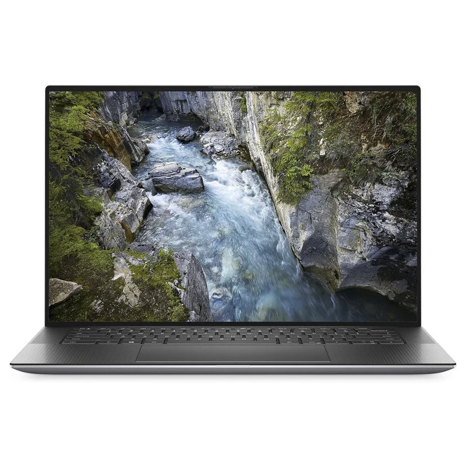

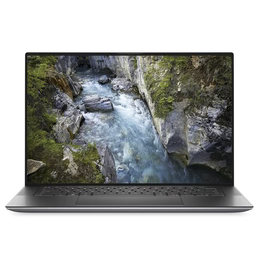

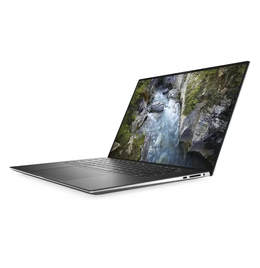

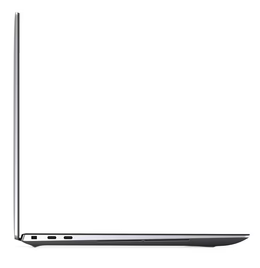

---

### Dell Latitude 3550

**Preis:** €851.99 🟡 *Akzeptabel (30-40% Rabatt)*

**Originalpreis:** €1399.00 | **Rabatt:** 39.1%

#### Technische Daten

| Spezifikation | Details |
|--------------|----------|
| **Prozessor** | Intel Core i5-1335U |
| **Kerne** | 10.0 |
| **Taktfrequenz** | 1.30/0.90 GHz |
| **RAM** | 16.0 GB DDR5 |
| **SSD** | 512.0 GB |
| **Bildschirm** | 15.6" |
| **Auflösung** | 1920x1080 (FullHD) |
| **Bewertung** | ⭐⭐⭐⭐ (4.5/5) |
| **Quelle** | [🔗 refurbed.de](https://www.refurbed.de/dell-latitude-3550) |

📸 Weitere Bilder

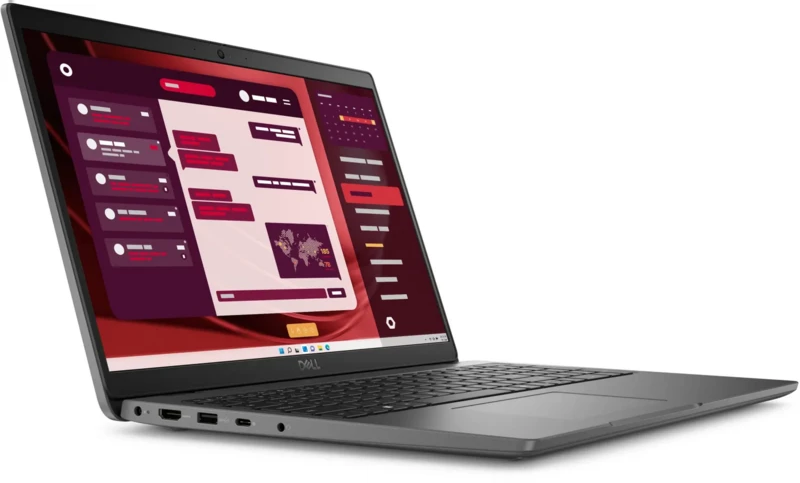

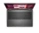

---

### Dell Precision 5550

**Preis:** €855.99 🟢 *Gut (50-60% Rabatt)*

**Originalpreis:** €1999.00 | **Rabatt:** 57.2%

#### Technische Daten

| Spezifikation | Details |
|--------------|----------|
| **Prozessor** | Intel Core i7-10850H |
| **Kerne** | 6.0 |
| **Taktfrequenz** | 2.70 GHz |
| **RAM** | 16.0 GB DDR4 |
| **SSD** | 512.0 GB |
| **Bildschirm** | 15.6" |
| **Auflösung** | 1920x1200 (WUXGA) |
| **Grafikkarte** | Nvidia Quadro T1000 |
| **Bewertung** | ⭐⭐⭐⭐ (4.5/5) |
| **Quelle** | [🔗 refurbed.de](https://www.refurbed.de/dell-precision-5550) |

📸 Weitere Bilder

---

### Dell Precision 7550

**Preis:** €876.99 🟢 *Sehr gut (>60% Rabatt)*

**Originalpreis:** €2439.00 | **Rabatt:** 64.0%

#### Technische Daten

| Spezifikation | Details |
|--------------|----------|
| **Prozessor** | Intel Core i7-10750H |
| **Kerne** | 6.0 |
| **Taktfrequenz** | 2.60 GHz |
| **RAM** | 32.0 GB DDR4 |
| **SSD** | 512.0 GB |
| **Bildschirm** | 15.6" |
| **Auflösung** | 1920x1080 (FullHD) |
| **Grafikkarte** | Quadro T1000 |
| **Bewertung** | ⭐⭐⭐⭐ (4.5/5) |
| **Quelle** | [🔗 refurbed.de](https://www.refurbed.de) |

📸 Weitere Bilder

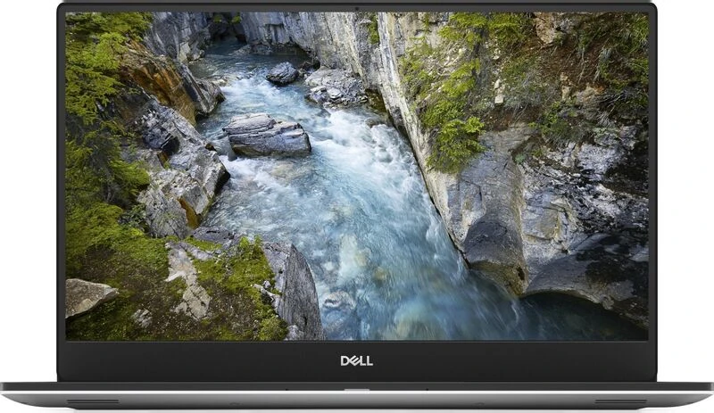

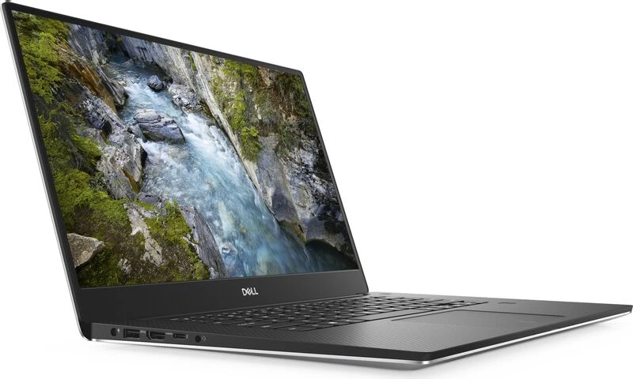

---

### Dell Precision 7560

**Preis:** €888.99 🟡 *Fair (40-50% Rabatt)*

**Originalpreis:** €1719.00 | **Rabatt:** 48.3%

#### Technische Daten

| Spezifikation | Details |
|--------------|----------|
| **Prozessor** | Intel Core i7-11850H |
| **Kerne** | 8.0 |
| **Taktfrequenz** | 2.50 GHz |
| **RAM** | 32.0 GB DDR4 |
| **SSD** | 1000.0 GB |
| **Bildschirm** | 15.6" |
| **Auflösung** | 1920x1080 (FullHD) |
| **Grafikkarte** | RTX A3000 |
| **Bewertung** | ⭐⭐⭐⭐ (4.5/5) |
| **Quelle** | [🔗 refurbed.de](https://www.refurbed.de) |

📸 Weitere Bilder

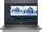

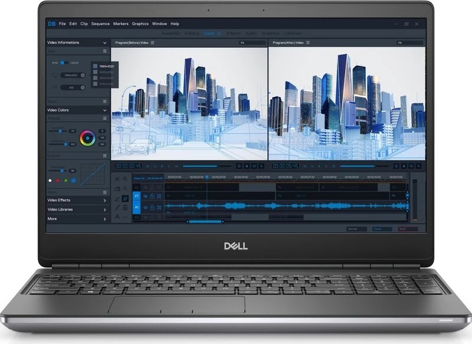

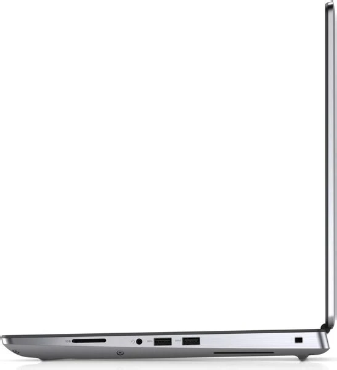

---

### Dell Latitude 5501

**Preis:** €901.99 🟢 *Gut (50-60% Rabatt)*

**Originalpreis:** €1999.00 | **Rabatt:** 54.9%

#### Technische Daten

| Spezifikation | Details |
|--------------|----------|
| **Prozessor** | Intel Core i7-9850H |
| **Kerne** | 6.0 |
| **Taktfrequenz** | 2.60 GHz |
| **RAM** | 32.0 GB DDR4 |
| **SSD** | 1000.0 GB |
| **Bildschirm** | 15.6" |
| **Auflösung** | 1920x1080 (FullHD) |
| **Grafikkarte** | MX150 |
| **Bewertung** | ⭐⭐⭐⭐ (4.5/5) |
| **Quelle** | [🔗 refurbed.de](https://www.refurbed.de) |

📸 Weitere Bilder

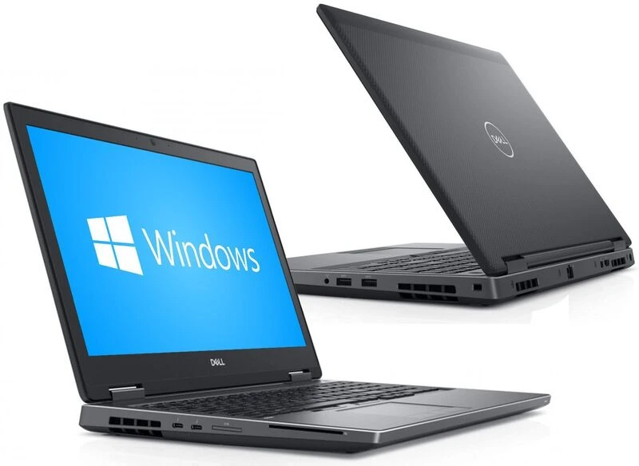

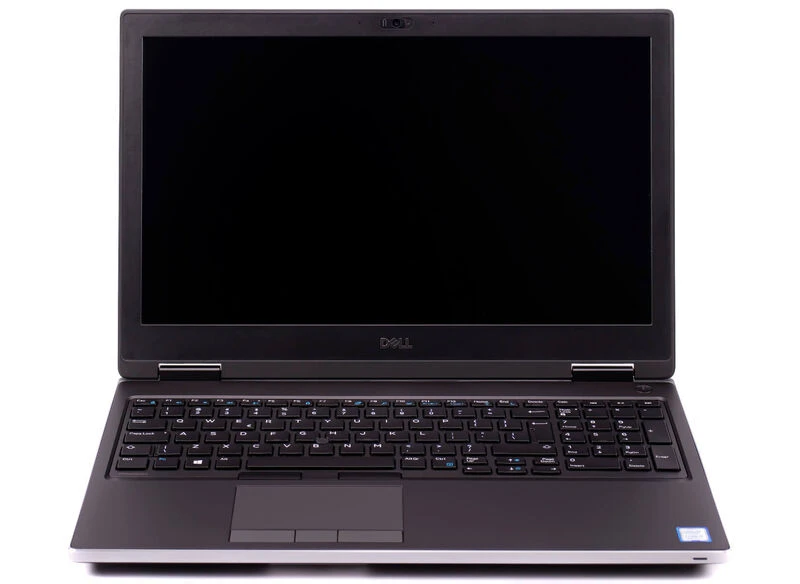

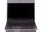

---

### Dell Precision 7540

**Preis:** €923.99 🟢 *Gut (50-60% Rabatt)*

**Originalpreis:** €2299.00 | **Rabatt:** 59.8%

#### Technische Daten

| Spezifikation | Details |
|--------------|----------|
| **Prozessor** | Intel Core i9-9880H |
| **Kerne** | 8.0 |
| **Taktfrequenz** | 2.30 GHz |
| **RAM** | 32.0 GB DDR4 |
| **SSD** | 512.0 GB |
| **Bildschirm** | 15.6" |
| **Auflösung** | 1920x1080 (FullHD) |
| **Grafikkarte** | Quadro T2000 Mobile |
| **Bewertung** | ⭐⭐⭐⭐ (4.5/5) |
| **Quelle** | [🔗 refurbed.de](https://www.refurbed.de) |

📸 Weitere Bilder

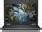

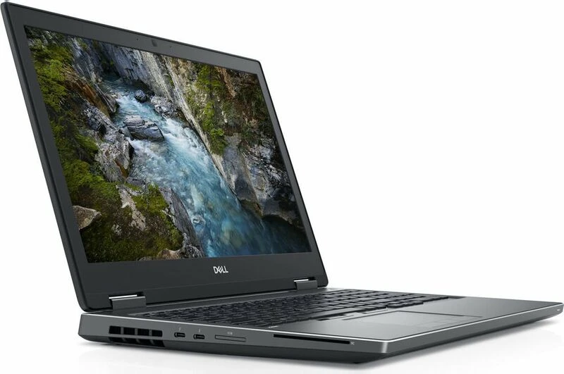

---

### Dell Precision 5560

**Preis:** €925.99 🟢 *Sehr gut (>60% Rabatt)*

**Originalpreis:** €2999.00 | **Rabatt:** 69.1%

#### Technische Daten

| Spezifikation | Details |
|--------------|----------|
| **Prozessor** | Intel Core i7-10850H |
| **Kerne** | 6.0 |
| **Taktfrequenz** | 2.70 GHz |
| **RAM** | 16.0 GB DDR4 |
| **SSD** | 512.0 GB |
| **Bildschirm** | 15.6" |
| **Auflösung** | 1920x1200 (WUXGA) |
| **Grafikkarte** | T1200 Mobile |
| **Bewertung** | ⭐⭐⭐⭐ (4.5/5) |
| **Quelle** | [🔗 refurbed.de](https://www.refurbed.de) |

📸 Weitere Bilder

---

### Dell Precision 5560

**Preis:** €944.99 🟢 *Sehr gut (>60% Rabatt)*

**Originalpreis:** €2669.00 | **Rabatt:** 64.6%

#### Technische Daten

| Spezifikation | Details |
|--------------|----------|
| **Prozessor** | Intel Core i7-11850H |
| **Kerne** | 8.0 |
| **Taktfrequenz** | 2.50 GHz |
| **RAM** | 16.0 GB DDR4 |
| **SSD** | 512.0 GB |
| **Bildschirm** | 15.6" |
| **Auflösung** | 1920x1200 (WUXGA) |
| **Grafikkarte** | T1200 |
| **Bewertung** | ⭐⭐⭐⭐ (4.5/5) |
| **Quelle** | [🔗 refurbed.de](https://www.refurbed.de) |

📸 Weitere Bilder

---

### Dell Precision 5560

**Preis:** €950.00 🟢 *Sehr gut (>60% Rabatt)*

**Originalpreis:** €2839.00 | **Rabatt:** 66.5%

#### Technische Daten

| Spezifikation | Details |
|--------------|----------|
| **Prozessor** | Intel Core i5-11500H |
| **Kerne** | 6.0 |
| **Taktfrequenz** | 2.40 GHz |
| **RAM** | 32.0 GB DDR4 |
| **SSD** | 500.0 GB |
| **Bildschirm** | 15.6" |
| **Auflösung** | 1920x1080 (FullHD) |
| **Grafikkarte** | T1200 |
| **Bewertung** | ⭐⭐⭐⭐ (4.5/5) |
| **Quelle** | [🔗 refurbed.de](https://www.refurbed.de) |

📸 Weitere Bilder

---

### Dell Precision 3561

 _ kleinanzeigen.de/Dell Precision 3561 i9 11950H 15 Zoll Notebook Workstation in Brandenburg - Frankfurt (Oder) _ kleinanzeigen.de_page2_img1.png)

**Preis:** €980.00 🟢 *Sehr gut (>60% Rabatt)*

**Originalpreis:** €3000.00 | **Rabatt:** 67.3%

#### Technische Daten

| Spezifikation | Details |
|--------------|----------|
| **Prozessor** | Intel Core i9-11950H |
| **Kerne** | nan |
| **RAM** | nan GB |
| **SSD** | nan GB |
| **Bildschirm** | 15" |
| **Quelle** | [🔗 kleinanzeigen.de](https://www.kleinanzeigen.de) |

📸 Weitere Bilder

 _ kleinanzeigen.de/Dell Precision 3561 i9 11950H 15 Zoll Notebook Workstation in Brandenburg - Frankfurt (Oder) _ kleinanzeigen.de_page2_img2.png)

 _ kleinanzeigen.de/Dell Precision 3561 i9 11950H 15 Zoll Notebook Workstation in Brandenburg - Frankfurt (Oder) _ kleinanzeigen.de_page3_img1.png)

 _ kleinanzeigen.de/Dell Precision 3561 i9 11950H 15 Zoll Notebook Workstation in Brandenburg - Frankfurt (Oder) _ kleinanzeigen.de_page3_img2.png)

 _ kleinanzeigen.de/Dell Precision 3561 i9 11950H 15 Zoll Notebook Workstation in Brandenburg - Frankfurt (Oder) _ kleinanzeigen.de_page3_img3.png)

---

## 📊 Schnellvergleich Tabelle

| Modell | Preis | Rabatt | CPU | RAM | SSD | GPU | Bewertung |
|--------|-------|--------|-----|-----|-----|-----|----------|
| [Dell Precision 5550](#dell-precision-5550) | €679.00 🔴 | 2.9% | i9-10885H | 32.0GB | 1000.0GB | NVIDIA Quadro T2000 | Zu teuer (<30% Rabatt) |
| [Dell Latitude 3550](#dell-latitude-3550) | €851.99 🟡 | 39.1% | i5-1335U | 16.0GB | 512.0GB | N/A | Akzeptabel (30-40% Rabatt) |
| [Dell Precision 5550](#dell-precision-5550) | €855.99 🟢 | 57.2% | i7-10850H | 16.0GB | 512.0GB | Nvidia Quadro T1000 | Gut (50-60% Rabatt) |
| [Dell Precision 7550](#dell-precision-7550) | €876.99 🟢 | 64.0% | i7-10750H | 32.0GB | 512.0GB | Quadro T1000 | Sehr gut (>60% Rabatt) |
| [Dell Precision 7560](#dell-precision-7560) | €888.99 🟡 | 48.3% | i7-11850H | 32.0GB | 1000.0GB | RTX A3000 | Fair (40-50% Rabatt) |
| [Dell Latitude 5501](#dell-latitude-5501) | €901.99 🟢 | 54.9% | i7-9850H | 32.0GB | 1000.0GB | MX150 | Gut (50-60% Rabatt) |
| [Dell Precision 7540](#dell-precision-7540) | €923.99 🟢 | 59.8% | i9-9880H | 32.0GB | 512.0GB | Quadro T2000 Mobile | Gut (50-60% Rabatt) |
| [Dell Precision 5560](#dell-precision-5560) | €925.99 🟢 | 69.1% | i7-10850H | 16.0GB | 512.0GB | T1200 Mobile | Sehr gut (>60% Rabatt) |
| [Dell Precision 5560](#dell-precision-5560) | €944.99 🟢 | 64.6% | i7-11850H | 16.0GB | 512.0GB | T1200 | Sehr gut (>60% Rabatt) |
| [Dell Precision 5560](#dell-precision-5560) | €950.00 🟢 | 66.5% | i5-11500H | 32.0GB | 500.0GB | T1200 | Sehr gut (>60% Rabatt) |
| [Dell Precision 3561](#dell-precision-3561) | €980.00 🟢 | 67.3% | i9-11950H | nanGB | nanGB | N/A | Sehr gut (>60% Rabatt) |

---

*Legende: 🟢 = Sehr gut/Gut | 🟡 = Fair/Akzeptabel | 🔴 = Zu teuer*
